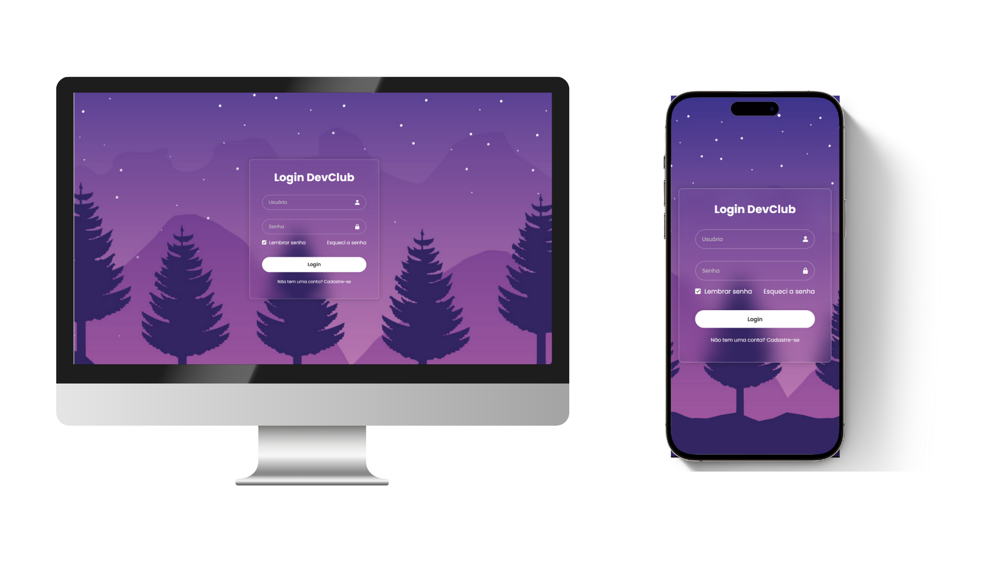

# 🔐 Tela de Login - HTML & CSS

Este projeto é uma interface moderna de tela de login desenvolvida como parte dos meus estudos no curso do DevClub. O objetivo foi aplicar conhecimentos de HTML e CSS para construir uma página estilosa, funcional e com foco em design responsivo.

---

## 📸 Preview

---

## 🚀 Tecnologias utilizadas

- HTML5
- CSS3
- Google Fonts (Poppins)
- Boxicons
- Design estilo Glassmorphism
- Responsividade com media queries

---

## 📱 Responsividade

A interface foi adaptada para funcionar bem em dispositivos móveis utilizando `@media queries`. Isso garante boa experiência em smartphones e tablets.

---

## 📌 Funcionalidades

- Interface amigável e moderna
- Campos com ícones
- Efeito de blur (glassmorphism)
- Links de "Esqueci a senha" e "Cadastre-se"
- Layout centralizado com fundo visual agradável

---

## ✅ Melhorias futuras

- Adicionar validação de formulário com JavaScript
- Exibir mensagens de erro ou sucesso
- Implementar funcionalidade de “mostrar/ocultar senha”
- Armazenar dados com LocalStorage (lembrar senha)

---

## 📚 Aprendizado

Este projeto me ajudou a consolidar conhecimentos de:
- Estruturação de formulários em HTML
- Posicionamento e layout com Flexbox
- Efeitos visuais modernos com CSS
- Boas práticas de design responsivo

---

## 🤝 Contato

📧 rafael.seuemail@email.com  
🔗 [LinkedIn - Rafael (Clique aqui)](https://www.linkedin.com/in/rafael-inui/)

---

Feito com 💻 por Rafael – Em transição para Desenvolvedor Front-End 🚀
